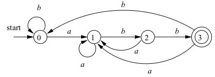

# Trabalhos da disciplina "INE5622 - Introdução a Compiladores" - UFSC

## Parte 0 - Implementação de AFD simples

Nesta tarefa, você deve implementar uma simulação simples do seguinte autômato finito determinístico (AFD):

Instruções:

- Use a linguagem que preferir
- Apresente um relatório, descrevendo a representação de cada um dos 5 elementos de uma representação formal de um AFD na sua implementação.
- Inclua no seu relatório, no mínimo, 3 exemplos de strings que são aceitas por esse AFD e 3 exemplos de strings rejeitadas por ele.